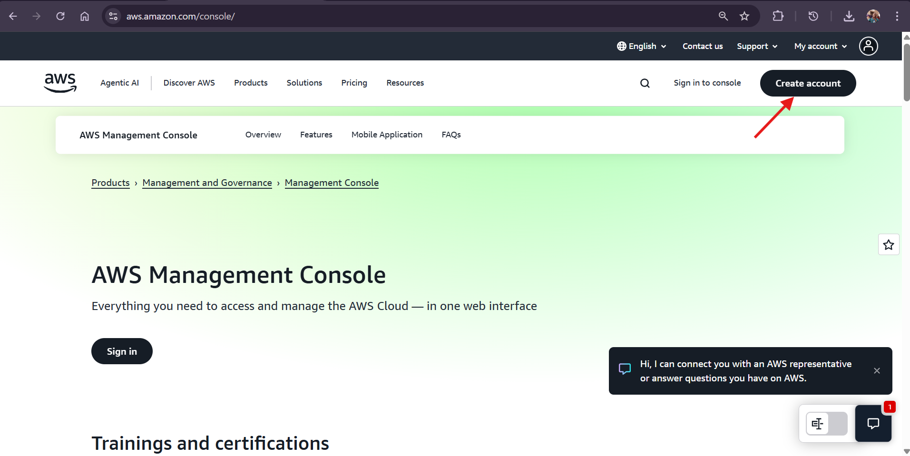

# AWS Account Creation Project  

This project demonstrates the process of creating and setting up an AWS account for cloud computing services. The setup includes account registration, IAM configuration, billing alerts, and initial security hardening.  

---

## 📌 Project Objectives  

- Create a new AWS account.  
- Configure IAM users and groups following best practices.  
- Set up billing alerts to monitor costs.  
- Enable security features like MFA (Multi-Factor Authentication).  
- Automate IAM and billing setup using AWS CLI.  
- Prepare the account for future deployments (e.g., EC2, S3).  

---

## 🛠️ Prerequisites  

- A valid **AWS Account**.  
- **AWS CLI** installed → [Install Guide](https://docs.aws.amazon.com/cli/latest/userguide/getting-started-install.html).  
- Configure AWS CLI with credentials:  
  ```bash
  aws configure
  ```  

---

## 🚀 Steps  

### 1️⃣ Create an IAM Group and User  

```bash
#!/bin/bash
# Variables
GROUP_NAME=AdminGroup
USER_NAME=AdminUser

# Create IAM Group
aws iam create-group --group-name $GROUP_NAME

# Attach Admin Policy to Group
aws iam attach-group-policy   --group-name $GROUP_NAME   --policy-arn arn:aws:iam::aws:policy/AdministratorAccess

# Create IAM User with console + programmatic access
aws iam create-user --user-name $USER_NAME

# Add User to Group
aws iam add-user-to-group --user-name $USER_NAME --group-name $GROUP_NAME

# Create Login Profile (console password)
aws iam create-login-profile   --user-name $USER_NAME   --password 'StrongPassword123!'   --password-reset-required

# Create Access Keys for programmatic access
aws iam create-access-key --user-name $USER_NAME
```


---

### 2️⃣ Enable Billing Alerts  

```bash
#!/bin/bash
# Enable billing alerts in account preferences
aws ce enable-anomaly-detection --anomaly-detection-id cost-monitoring

# Create CloudWatch billing alarm
aws cloudwatch put-metric-alarm   --alarm-name "Billing-Alarm"   --metric-name EstimatedCharges   --namespace AWS/Billing   --statistic Maximum   --period 21600   --threshold 10   --comparison-operator GreaterThanThreshold   --evaluation-periods 1   --alarm-actions arn:aws:sns:us-east-1:123456789012:BillingAlerts   --region us-east-1
```

---

### 3️⃣ Secure the Root Account (Manual Step)  

- Enable **MFA (Multi-Factor Authentication)** for the root account.  
- Use **Google Authenticator** or a hardware MFA device.  


---

## ✅ Final Outcome  

By completing this project, you will have:  
- A working AWS account.  
- Secured root access with MFA.  
- IAM group and admin user set up via automation.  
- Billing alerts enabled to monitor costs.  

---

## 📂 Next Steps  

- Deploy an **EC2 instance** and connect via SSH.  
- Create **S3 buckets** for storage.  
- Explore **VPC networking** and **serverless Lambda functions**.  

## Task ##
 - Create an AWS account



- Enter the valid required details like email address, Password and AWS account name


- Sign in into the Account with the required credentials


- Enter the displayed CAPTCHA


- You have successfully logged in to your Amazon Web Services account


