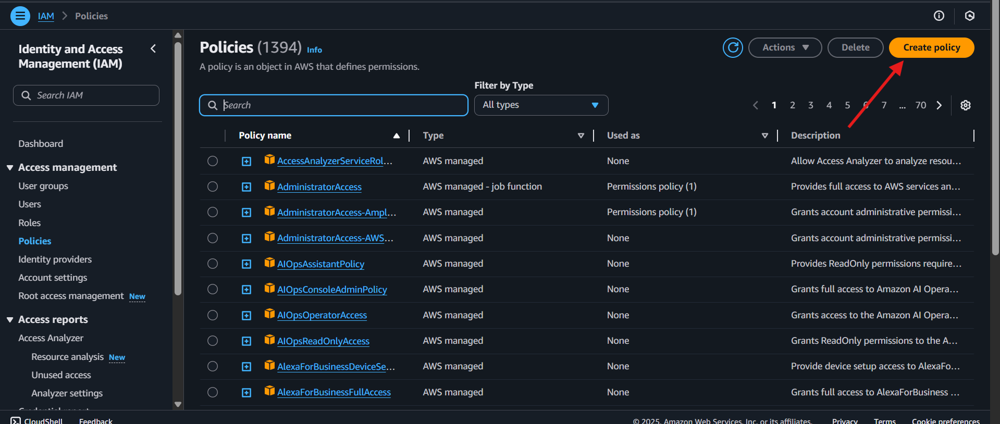
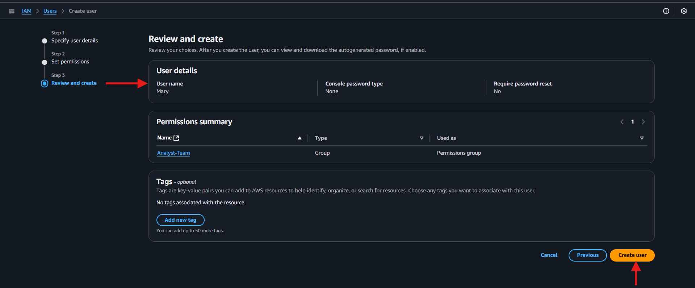
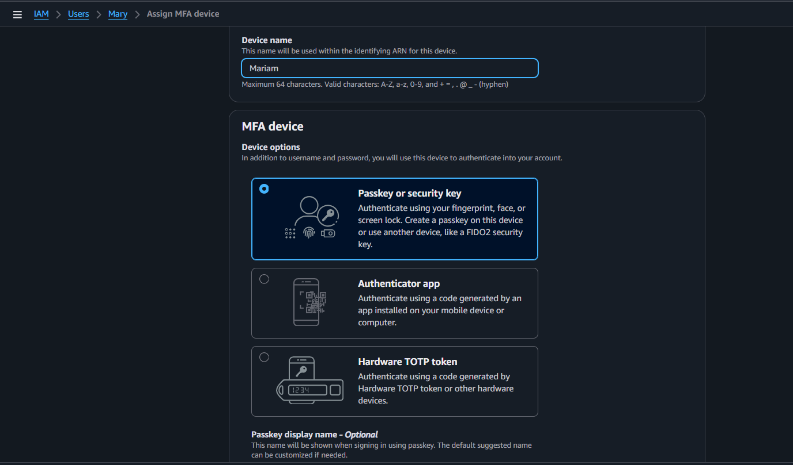

# 🌐 Introduction to Cloud Computing – Security & Identity Management (IAM)

## 📖 Project Overview
This mini project introduces **Amazon Web Services (AWS) Identity and Access Management (IAM)** using the fintech startup **Zappy e-Bank** as a case study. This project is designed to guide you through the intricacies of Amazon Web Services (AWS), specifically focusing on Identity and Access Management (IAM).   

Zappy e-Bank is a fictitious company venturing into financial technology services, relying on cloud infrastructure to innovate and scale securely. Given its responsibility for **sensitive customer data**, implementing strong identity and access controls is **critical**.  

Through this hands-on project, you will learn how to:
- Create and manage IAM users and groups.  
- Use IAM roles and policies to enforce fine-grained permissions.  
- Implement strong access controls (e.g., MFA).  
- Apply real-world best practices for securing AWS environments.  

---

## 🎯 Project Goals & Learning Outcomes
By the end of this project, you will have:
1. **Gained a solid understanding** of AWS IAM concepts (users, groups, roles, and policies).  
2. **Applied IAM in practice** to secure a fintech startup’s cloud infrastructure.  
3. **Developed practical AWS Console skills** in managing IAM resources.  
4. **Understood compliance and data security impacts** of IAM in the fintech industry.  

---

## 🏢 Scenario: IAM for Zappy e-Bank

Think of AWS as a **large secure building** (your AWS account).  
- The **root user** is like the **master key** to this building. It can open every door and make changes to the structure itself.  
- Because it’s too powerful, you don’t hand out this key to everyone. Instead, you issue **smaller, task-specific keys** (IAM users).  
- Each key (user) only opens the **doors they need** (specific AWS services).  

For Zappy e-Bank:  
- **Backend Developer (John)** → Needs **EC2 access** to deploy and run applications.  
- **Data Analyst (Mary)** → Needs **S3 access** to analyze and store financial data.  

As Zappy e-Bank grows (10 more developers and 5 more analysts in the next phase), IAM groups and policies will ensure **scalable and consistent permission management**.  

---

## 🛠️ Step-by-Step Exercises  
---------
### creating **Policy** 

 _This exercise include_
- Creating a single policy tailored to each **role's access** requirements
- Associating this policy with a **group** specifically designed for that role. 
- Adding all engineers or analysts to their respective groups, simplifying the management of permissions and ensuring consistent access across the team. 

### Creating policy for the Developement team
- In the IAM console, click on policies

- Click on create policy

- In the select a service section, search for **EC2** 

- For simplicity sake, select the "**All EC2 actions**" checkbox
- Also, make sure to select "**All**" in the Resources section
- Click Next
- Provie the name **developers** and description for the policy 
- Click on **Create Policy**

### Creating policy for the Data Analyst team 
Repeat the process above for the Data Analysts team, but instead of **EC2**, search for **S3**. Also name the policy **analyst** instead of **developers**. You can give it any decription of your choice. 

- In the select a service section, search for **S3**

- For simplicity sake, select the "**All S3 actions**" checkbox 

- Provide the name **analyst** and description for the policy
- Click on **Create policy**  

## Creating **Group**
### Create group for the Development team
- In the IAM console navigation, select **USer group** and in the top right click **Create group**

- Provide a name for the group 

- Attach the developer policy created earlier to the group. This will allow any uer in the **Development-Team** group to have access to **EC2** instances **alone**.

- You have successfully created a group and attached a permission policy for any user added to the group to have access to the EC2 instance only

### Create group for the Analysts team
Rapeat the process above for the Data Analysts team. 
- The group name should be **Anlayst-Team**

- Instead of attaching developers policy, attach analyst policy

- Successfully created Analyst Team 

##  Creating IAM for Users

### Creating IAM User for John 
let's recall that John is a backend developer, therefore he need to be added as a user to the **Development-Team** group 
- Navigate to the IAM dashboard, select **"Users"** and then click **"Create user"**

- Provide "John" as the name of the User

- Ensure that the user can access the AWS MAnagement Console. IF this not selected, the user will not be able to login from the web browser.
- Permission: Add the "John" to the development team group 

- Click on **Create user**

- Create and Download the login credentials for John

### Creating IAM User for Mary
Repeat the sam step for Mary, but recall that Mary is a Data analyst, which means she need to be added as a suer to the **Analyst_Team** group.
- Provide "Mary" as the name of the user 

- Permission: Add the user "Mary" to the Analyst team group

- Click on **Create user** to create the "Mary" User

- Create and Download the login credentials for Mary

## Testing and Validation 

Login as John and Mary using the credentinals provided to log into the AWS Management console. This simulates user experience and ensures user has correct access. 

## Implement Multi-Factor Authentication (MFA)
Now that you have crated a new users. Let's create Multi-Factor Authentication. Multi-Factore Authentication (MFA) is a **security** feature that adds an extra layer of **protection** to your AWS account and resources. With MFA enabled, users are required to provide two or more forms of authentication before they can access AWS resources. 

### Setting Up MFA for John 
- Click on **User** and then click on John. It is assummed we already created a user account for John 

- Click on enable MFA 
-  Enter a device name for John MFa and select any of the MFA that best suite you 

- Click on Next 

### Setting up MFA for Mary 
- Repeat the same step for Mary

---------------------------------------------
# 📝 Project Reflection – AWS IAM for Zappy e-Bank

## 1. Role of IAM in AWS
Identity and Access Management (IAM) in **Amazon Web Services (AWS)** provides a framework for securely managing access to cloud resources. Its purpose is to control **who can access specific resources**, **what actions they can perform**, and **under what conditions**.  

IAM contributes to:
- **Security**: Ensures that only authorized users and services can interact with sensitive financial data.  
- **Efficiency**: Centralized management of permissions reduces administrative overhead.  
- **Compliance**: Enforces strict access control policies required by financial regulations.  
- **Scalability**: Supports growth by allowing consistent permission management as new employees or services are added.  

For **Zappy e-Bank**, IAM is critical in protecting customer financial records and enabling safe collaboration among developers, analysts, and administrators.  

---

## 2. Differentiating Between IAM Users and Groups
- **IAM Users**: Individual digital identities in AWS, representing a single person or application. Each IAM user has unique credentials (username, password, or access keys).  
  - Example: Creating an IAM user for **John (developer)** or **Mary (data analyst)** with permissions tailored to their roles.  

- **IAM Groups**: Collections of IAM users. Permissions are assigned to the group, and all users in that group inherit those permissions.  
  - Example: Creating a **Developer-Team group** for backend engineers and attaching EC2-related policies, instead of assigning permissions to each developer individually.  

📌 **When to use:**  
- **IAM User** → For one-off roles, such as a third-party auditor requiring temporary access.  
- **IAM Group** → For teams with similar responsibilities (e.g., all data analysts needing S3 access).  

---

## 3. Process of Creating IAM Policies
IAM policies define what actions are allowed or denied for specific AWS resources.  

### **Steps to Create a Custom IAM Policy**
1. **Open the IAM Console** → Navigate to *Policies → Create Policy*.  
2. **Choose Service** → Select the AWS service (e.g., EC2, S3).  
3. **Define Actions** → Specify what actions are permitted (`ec2:StartInstances`, `s3:GetObject`).  
4. **Select Resources** → Restrict permissions to specific resources (e.g., one S3 bucket).  
5. **Review and Name** → Provide a meaningful name (e.g., `Developer-EC2-Policy`).  
6. **Attach Policy** → Assign the policy to users, groups, or roles.  

📌 Example:  
- **Developer Policy** → Allows `ec2:*` actions for backend engineers.  
- **Analyst Policy** → Allows `s3:*` actions for data analysts.  

---

## 4. Significance of the Principle of Least Privilege
The **Principle of Least Privilege (PoLP)** states that users, applications, and services should be granted **only the minimum level of access required** to perform their tasks, and nothing more.  

### **Why It’s Important in IAM and AWS**
- **Reduces Risk**: Minimizes accidental or malicious misuse of resources.  
- **Enhances Compliance**: Aligns with regulatory frameworks (e.g., PCI DSS, GDPR).  
- **Protects Sensitive Data**: Prevents unauthorized access to customer accounts and transactions.  
- **Supports Operational Efficiency**: Ensures clear boundaries of responsibility between different teams.  

📌 Example in Zappy e-Bank:  
- John (developer) can manage EC2 but **cannot access customer data in S3**.  
- Mary (analyst) can access S3 but **cannot launch or terminate EC2 instances**.  

---

## 5. Reflection on John and Mary’s Scenario
### **John (Backend Developer)**  
- **IAM User**: `John`  
- **Group**: `Developer-Team`  
- **Policy**: `Developer-EC2-Policy` → Full access to EC2 resources.  
- **Alignment**: Matches his role of deploying and maintaining applications without exposing customer data.  

### **Mary (Data Analyst)**  
- **IAM User**: `Mary`  
- **Group**: `Analyst-Team`  
- **Policy**: `Analyst-S3-Policy` → Access to S3 resources for financial data analysis.  
- **Alignment**: Matches her role of analyzing stored data without unnecessary permissions for infrastructure management.  

✅ These configurations reflect **real-world role-based access control (RBAC)** and strictly follow the **Principle of Least Privilege**, ensuring each role only has access to the resources required for their job.  

---

# 📌 Final Summary
This project demonstrates how AWS IAM supports secure, efficient, and compliant operations for a fintech startup. By carefully distinguishing between **users, groups, roles, and policies**, Zappy e-Bank ensures that its employees and systems operate within the boundaries of **least privilege**, thereby safeguarding customer data and supporting future scalability.  
