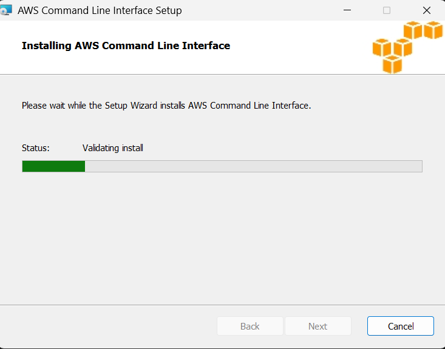
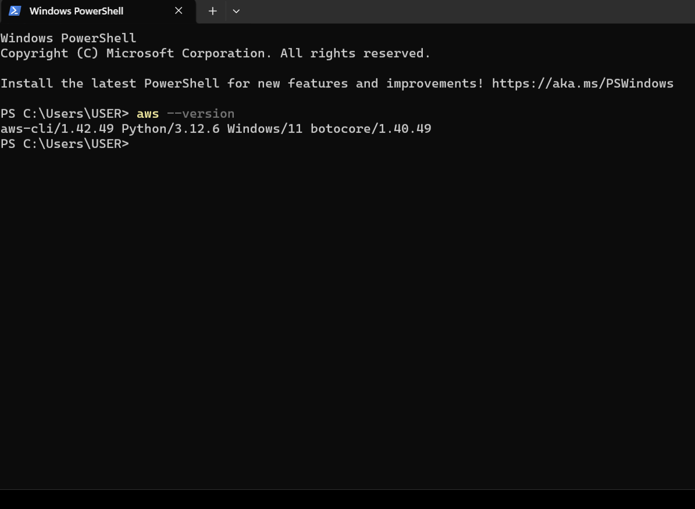

# 🧰 AWS CLI Installation Guide on Linux

This guide walks you through installing **AWS Command Line Interface (CLI)** on a Linux system using either the **v1 (Python-based)** or the **v2 (standalone)** installer.

---

## 🚀 Prerequisites
Before installing, make sure your system is up to date:
```bash
sudo apt update && sudo apt upgrade -y
```

You’ll also need:
- `curl` or `wget`
- `unzip`
- `sudo` privileges
- Python (for AWS CLI v1 only)

---

## 🧩 Option 1: Install AWS CLI v1 (Python-based)

### Step 1: Download the AWS CLI Bundle
```bash
curl "https://s3.amazonaws.com/aws-cli/awscli-bundle.zip" -o "awscli-bundle.zip"
```

### Step 2: Unzip the Bundle
```bash
unzip awscli-bundle.zip
```

### Step 3: Check Python Installation
AWS CLI v1 requires **Python 2.7+ or Python 3.6+**.  
Run:
```bash
python3 --version
```

If Python is installed but `python` is missing:
```bash
sudo ln -s /usr/bin/python3 /usr/bin/python
```

Verify:
```bash
python --version
```

### Step 4: Install the CLI
```bash
sudo ./awscli-bundle/install -i /usr/local/aws -b /usr/local/bin/aws
```

### Step 5: Verify the Installation
```bash
aws --version
```

You should see something like:
```
aws-cli/1.27.159 Python/3.8.10 Linux/5.15.0 botocore/1.29.159
```

---

## ⚡ Option 2: Install AWS CLI v2 (Recommended)

AWS CLI v2 is the latest version, self-contained, and **does not depend on Python**.

### Step 1: Download the Package
```bash
curl "https://awscli.amazonaws.com/awscli-exe-linux-x86_64.zip" -o "awscliv2.zip"
```

### Step 2: Unzip the Installer
```bash
unzip awscliv2.zip
```

### Step 3: Install AWS CLI v2
```bash
sudo ./aws/install
```

### Step 4: Verify Installation
```bash
aws --version
```

Example output:
```
aws-cli/2.15.59 Python/3.11.6 Linux/5.15.0 exe/x86_64.ubuntu.20 prompt/off
```

---

## 🧠 Troubleshooting

| Issue | Solution |
|-------|-----------|
| `/usr/bin/env: ‘python’: No such file or directory` | Create a Python symlink: `sudo ln -s /usr/bin/python3 /usr/bin/python` |
| `unzip: command not found` | Install unzip: `sudo apt install unzip -y` |
| Permission denied | Add `sudo` before the command |
| Old version still showing after install | Remove old CLI: `sudo rm /usr/local/bin/aws` and reinstall v2 |

---

## 🧭 Verify Configuration

After installation, configure your credentials:
```bash
aws configure
```
Enter:
- **AWS Access Key ID**
- **AWS Secret Access Key**
- **Default region name**
- **Default output format**

Then test:
```bash
aws s3 ls
```

---

### 🧾 References
- [AWS CLI Official Docs](https://docs.aws.amazon.com/cli/latest/userguide/cli-chap-install.html)
- [AWS CLI GitHub Repository](https://github.com/aws/aws-cli)

---
# AWS CLI Installation (Windows)

This document explains how to install, verify, configure, and troubleshoot the AWS Command Line Interface (AWS CLI) version 2 on Windows (PowerShell and Command Prompt). It covers multiple install methods (MSI, `winget`, Chocolatey), checksum verification, adding to PATH, configuring credentials, uninstalling, and common troubleshooting tips.

## Supported platforms
- Windows 10 and later (64-bit). For ARM/ARM64 builds, check AWS download pages.

## Quick summary (recommended)
1. Recommended: Install with the official MSI from AWS for a simple, supported install.
2. Alternative: Install via `winget` or Chocolatey for automated installs.
3. Verify with `aws --version` and configure with `aws configure`.

---

## 1. Prepare
- Open PowerShell as Administrator for system-wide installs (right-click PowerShell -> Run as administrator). For per-user installs, an elevated prompt isn't required.
- Check your current AWS CLI version (if any):

  ```powershell
  aws --version
  ```

- If `aws` is not found or you want to upgrade, follow the steps below.

## 2. Install methods

### A. Official MSI installer (GUI/Installer)
1. Download the MSI from the AWS official docs: https://aws.amazon.com/cli/
2. Choose the 64-bit MSI for Windows (look for "Windows (64-bit)" link) and save `AWSCLIV2.msi`.
3. Double-click the MSI and follow the installer prompts. Choose the default options unless you have custom requirements.
4. By default, the installer installs to `C:\Program Files\Amazon\AWSCLIV2` and adds `aws` to your PATH.

After installation, verify:

```powershell
aws --version
# Example output: aws-cli/2.17.44 Python/3.9.11 Windows/10 exe/AMD64 prompt/off
```

If the command returns a version, the installation succeeded.

### B. winget (Windows Package Manager)
1. Ensure `winget` is installed (Windows 10 1809+ / App Installer). Check with:

```powershell
winget --version
```

2. Install AWS CLI v2:

```powershell
winget install -e --id Amazon.AWSCLI
```

3. Verify:

```powershell
aws --version
```

winget installs system-wide when run from an elevated PowerShell.

### C. Chocolatey (choco)
1. Install Chocolatey if you don't have it. Follow instructions at https://chocolatey.org/install (requires an elevated PowerShell).
2. Install AWS CLI v2 using Chocolatey:

```powershell
choco install awscli -y
```

3. Verify with:

```powershell
aws --version
```

Note: Chocolatey's `awscli` package historically pointed to v1; check the package description to ensure v2 is installed. Use AWS MSI or winget for the most current v2 packages.

### D. MSI (command line install)
If you prefer running the MSI silently (useful for automation):

```powershell
msiexec /i "C:\path\to\AWSCLIV2.msi" /qn /norestart
```

This installs the MSI quietly. To uninstall:

```powershell
msiexec /x {product-code-guid} /qn
```

(Use the product GUID listed in Programs and Features or the MSI properties if needed.)


## 3. Verify installation and PATH
- Check `aws` executable:

```powershell
Get-Command aws
```

- Check version:

```powershell
aws --version
```

- If `aws` isn't found after installing with the MSI, restart your shell or log out/in to refresh the PATH. Confirm `C:\Program Files\Amazon\AWSCLIV2\` is on your PATH.

## 4. Verify checksum (optional, security-conscious users)
1. On the AWS download page you can download the SHA256 checksum file for the MSI.
2. Download `AWSCLIV2.msi` and the checksum file (e.g., `AWSCLIV2_windows_x86_64.msi.sha256`).
3. Compute the checksum in PowerShell and compare:

```powershell
Get-FileHash -Path 'C:\path\to\AWSCLIV2.msi' -Algorithm SHA256 | Format-List
```

Compare the hash string with the one provided on the AWS website.

## 5. Configure the AWS CLI
Run the interactive configuration to set up credentials and default region/output format:

```powershell
aws configure
```

You will be prompted for:
- AWS Access Key ID
- AWS Secret Access Key
- Default region name (e.g., us-east-1)
- Default output format (json, text, table)

These values are stored in `~\.aws\credentials` and `~\.aws\config` (per-user). For scripts, consider using environment variables or named profiles:

```powershell
Set-Item -Path Env:AWS_ACCESS_KEY_ID -Value "YOUR_ACCESS_KEY"
Set-Item -Path Env:AWS_SECRET_ACCESS_KEY -Value "YOUR_SECRET_KEY"
Set-Item -Path Env:AWS_DEFAULT_REGION -Value "us-east-1"
```

Or use a named profile:

```powershell
aws configure --profile myprofile
aws s3 ls --profile myprofile
```

## 6. Common post-install tasks
- Update the AWS CLI:
  - MSI: download new MSI and run installer.
  - winget: `winget upgrade Amazon.AWSCLI` (if available).
  - choco: `choco upgrade awscli -y`.
- Re-open PowerShell after install/upgrade to pick up PATH changes.

## 7. Uninstall
- Use Settings -> Apps -> find "AWS Command Line Interface" -> Uninstall.
- Or via msiexec: find the product GUID and run `msiexec /x {GUID}`.

## 8. Troubleshooting
- aws command not found: ensure installation path is on PATH, restart shell.
- Permission errors during install: run PowerShell as Administrator.
- Unexpected version: multiple `aws` executables on PATH; check `Get-Command aws | Select-Object Path` and remove/rename older installations.
- Proxy issues: configure environment variables `HTTP_PROXY` and `HTTPS_PROXY` before running `aws configure` or add proxy configuration at the system level.

## 9. Example usage (PowerShell)

```powershell
# List S3 buckets using default profile
aws s3 ls

# List EC2 instances in a region with a profile
aws ec2 describe-instances --region us-east-1 --profile myprofile
```

## 10. Additional resources
- Official docs: https://docs.aws.amazon.com/cli/latest/userguide/getting-started-install.html
- AWS CLI v2 release notes: https://github.com/aws/aws-cli/blob/v2/CHANGELOG.rst
---



