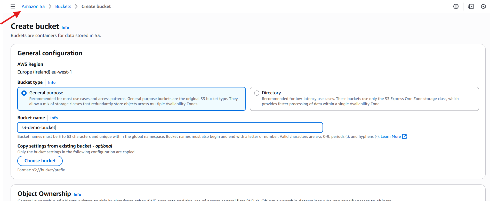
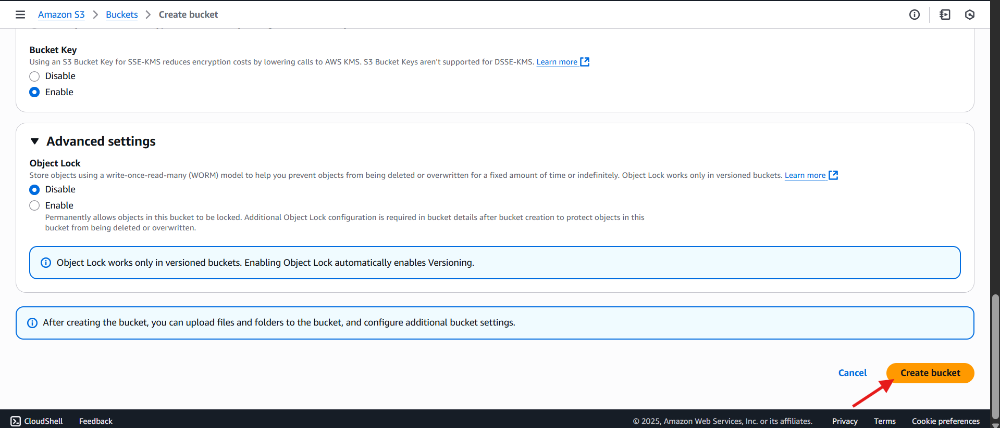
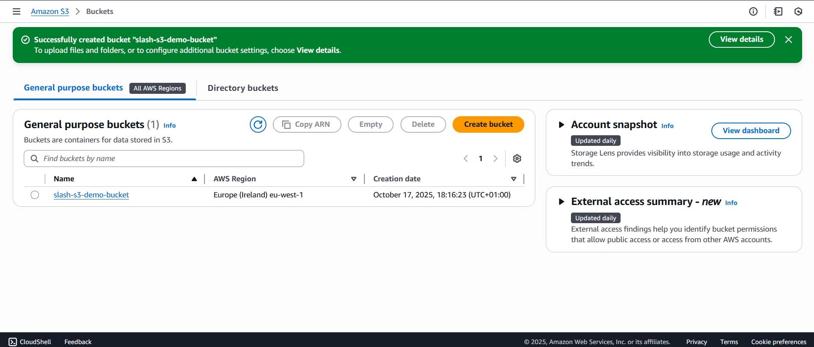
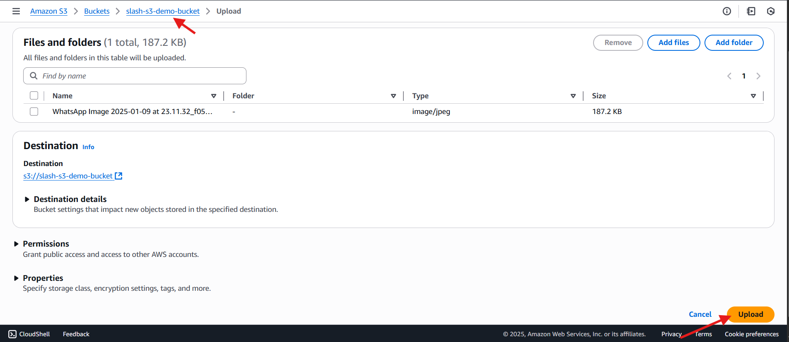
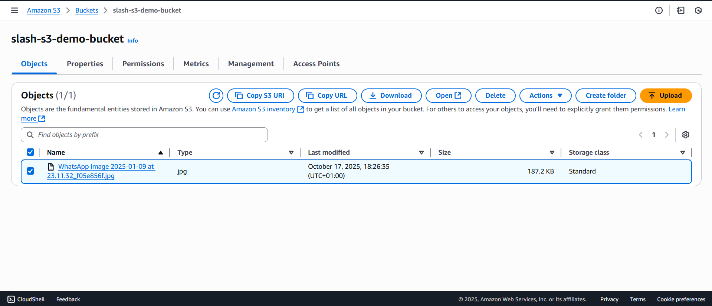
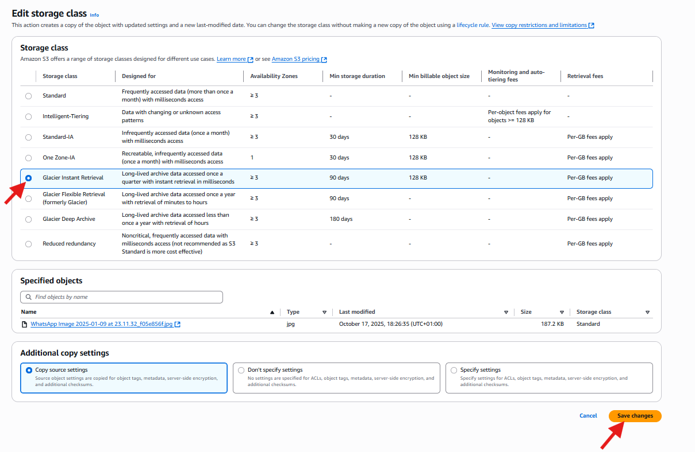
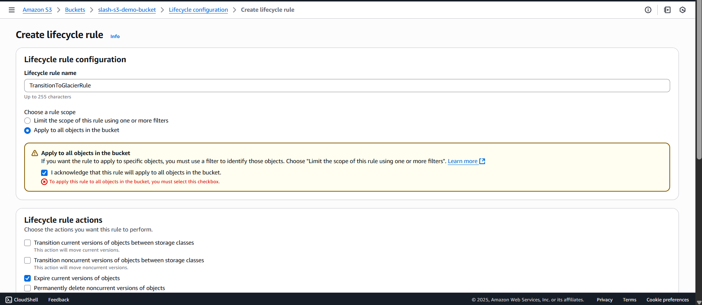
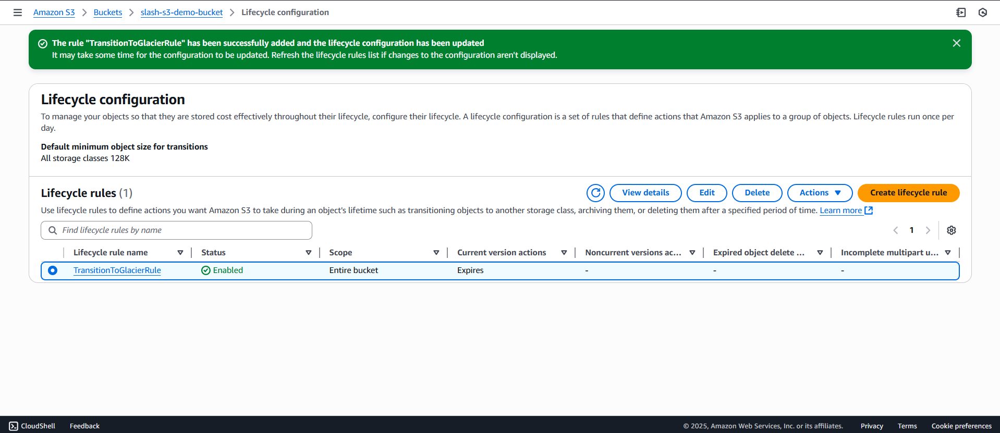
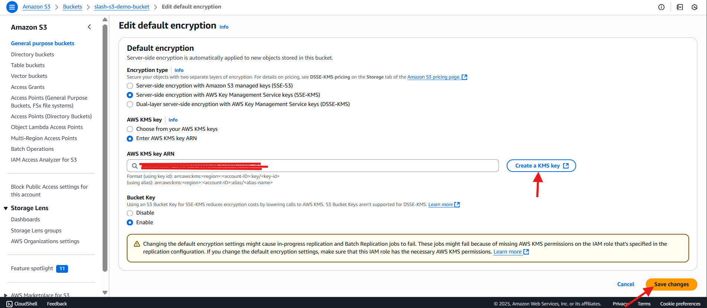

# ☁️ AWS S3 Capstone Project (Console-Based Guide)

## 🧭 Project Abstract
This AWS S3 Capstone Project demonstrates practical hands-on experience in configuring and managing Amazon Simple Storage Service (S3) using the AWS Management Console. 
The objective of this project is to showcase the ability to create and manage S3 buckets, implement lifecycle rules, enforce access control and security, and automate tasks using event notifications. 
By completing this project, learners gain foundational skills in AWS storage management, data security, and cost optimization—key competencies for any cloud or DevOps professional.

---

## 📘 Overview
This capstone project demonstrates how to configure and manage **Amazon S3 (Simple Storage Service)** using the AWS Management Console.  
The tasks include creating an S3 bucket, uploading objects, applying lifecycle rules, managing permissions, enabling versioning, and setting up event notifications.

---

## 🎯 Objectives
By the end of this project, you will:
- Understand core S3 concepts (buckets, objects)
- Manage S3 storage classes
- Implement lifecycle rules for cost optimization
- Secure your bucket using encryption and access policies
- Configure event notifications and versioning

---

## 🧩 Key S3 Concepts
| Concept | Description |
|----------|--------------|
| **Bucket** | A container for storing objects (files, data, images, etc.) |
| **Object** | The actual data stored in S3 (including metadata and permissions) |
| **Storage Class** | Defines the access frequency and cost tier for stored data |
| **Lifecycle Rules** | Automates transitions or deletion of objects |
| **Bucket Policy** | Controls who can access your bucket and what actions they can perform |
| **Versioning** | Keeps multiple versions of the same object |
| **Event Notifications** | Triggers actions (SNS/SQS/Lambda) when objects are created, deleted, or modified |

---

## 🧱 Step 1: Create an S3 Bucket

### Steps
1. Log in to **AWS Management Console**.
2. Navigate to **Services → S3**.
3. Click **“Create bucket.”**
4. Enter a unique bucket name, e.g., `slack-s3-demo-bucket`.
5. Select a **region** (e.g., `eu-east-1`).
6. Leave all other options as default or modify:
   - **Block Public Access:** Enabled (recommended)
   - **Versioning:** Disabled (will enable later)
7. Click **Create bucket.**

📸 *Screenshot #1:* Bucket creation screen 

📸 *Screenshot #2:* Bucket successfully created   

Bucket list 

---

## 🪣 Step 2: Upload Files (Objects)

### Steps
1. Click the bucket name to open it.
2. Select **“Upload” → “Add files.”**
3. Choose files from your local computer.
4. Click **Upload.**

📸 *Screenshot #3:* Upload dialog showing selected files 

📸 *Screenshot #4:* Uploaded files listed in the bucket  

---

## 🧱 Step 3: Explore and Change Storage Classes

### Steps
1. Select an object in the bucket.
2. Go to **Properties → Storage class.**
3. Click **Edit** to change from **Standard** to another class (e.g., *Glacier Instant Retrieval*).
4. Click **Save changes.**

📸 *Screenshot #5:* Storage class selection 

---

## ♻️ Step 4: Create Lifecycle Rules

### Steps
1. Open your bucket → **Management** tab.
2. Scroll to **Lifecycle rules → Create lifecycle rule.**
3. Name it (e.g., `TransitionToGlacierRule`).
4. Apply to all objects.
5. Choose:
   - “Transition current versions of objects between storage classes.”
6. Set transition:
   - Move to *Glacier Flexible Retrieval* after 30 days.
7. Optionally, set **Expiration** to delete after 365 days.
8. Click **Create rule.**

📸 *Screenshot #6:* Lifecycle rule creation screen 
📸 *Screenshot #7:* Lifecycle rule summary view  

---

## 🔐 Step 5: Secure the Bucket (Prevent Data Leaks)

### A. Enable Default Encryption
1. Go to the **Properties** tab.
2. Scroll to **Default encryption → Edit.**
3. Choose **Server-side encryption with Amazon S3-managed keys (SSE-S3).**
4. Click **Save changes.**

📸 *Screenshot #8:* SSE-S3 encryption enabled 

### B. Block Public Access
1. Go to **Permissions → Block public access (bucket settings).**
2. Ensure all options are turned **ON**.
3. Save changes.
 

---

## 🔔 Step 6: Configure S3 Events

### Steps
1. Go to the **Properties** tab.
2. Scroll to **Event notifications → Create event notification.**
3. Name it (e.g., `UploadNotification`).
4. Select **All object create events.**
5. For **Destination**, choose **SNS topic** or **SQS queue**.
6. Click **Save changes.**


---

## 🧩 Step 7: Enable Versioning

### Steps
1. Go to **Properties → Bucket Versioning.**
2. Click **Edit → Enable.**
3. Save changes.


---

## 🪪 Step 8: Configure Bucket Policy (Permissions)

### Steps
1. Go to **Permissions → Bucket policy → Edit.**
2. Paste this JSON (modify the account ID and username):

```json
{
  "Version": "2012-10-17",
  "Statement": [
    {
      "Sid": "AllowReadAccessToDevUser",
      "Effect": "Allow",
      "Principal": { "AWS": "arn:aws:iam::123456789012:user/DevUser" },
      "Action": ["s3:GetObject"],
      "Resource": ["arn:aws:s3:::slash-s3-demo-bucket/*"]
    }
  ]
}
```

3. Click **Save changes.**

📸 *Screenshot #12:* Bucket policy editor  
📸 *Screenshot #13:* Policy applied successfully  

---

## 🧪 Step 9: Test Permissions (Optional)
- Log in as the IAM user specified in the policy.
- Try accessing or downloading an object from the bucket.

📸 *Screenshot #14:* Successful or denied access message  

---

## ✅ Step 10: Summary and Reflection

### What You’ve Accomplished
- Created and configured an **Amazon S3 bucket**
- Managed **objects and storage classes**
- Implemented **lifecycle automation**
- Enhanced **security** with encryption and access policies**
- Configured **event notifications**
- Enabled **versioning** for data protection

### Reflection (to complete after your demo)
> 🗒️ *Describe what you learned, challenges you faced, and how this project improved your understanding of AWS S3.*

---

## 📷 Screenshot Summary

| Step | Description | Screenshot Name |
|------|--------------|----------------|
| 1 | Bucket creation | `bucket_creation.png` |
| 2 | Bucket created | `bucket_list.png` |
| 3 | File upload | `upload_file.png` |
| 4 | Uploaded file visible | `upload_complete.png` |
| 5 | Storage class change | `storage_class.png` |
| 6 | Lifecycle rule setup | `lifecycle_rule.png` |
| 7 | Encryption enabled | `encryption_enabled.png` |
| 8 | Block public access | `block_public_access.png` |
| 9 | Event notification | `event_notification.png` |
| 10 | Versioning enabled | `versioning_enabled.png` |
| 11 | Bucket policy | `bucket_policy.png` |
| 12 | Permission test | `access_test.png` |

---

## Resources
- [AWS S3 Documentation](https://docs.aws.amazon.com/s3/)
- [S3 Best Practices for Security](https://docs.aws.amazon.com/AmazonS3/latest/userguide/security-best-practices.html)
- [AWS Free Tier S3 Pricing](https://aws.amazon.com/s3/pricing/)
